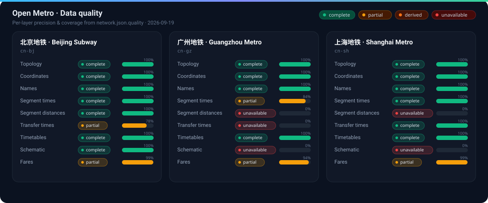

# Data quality

Generated from each network’s `network.json.quality` after data sync. Do not edit by hand — re-run `bun run data:sync` (or `scripts/write-quality-report.ts`).

_Updated 2026-09-16T19:27:24.746Z_

## 北京地铁 / Beijing Subway (`cn-bj`)

| Layer | Status | Precision | Coverage | Counts |
| --- | --- | --- | --- | --- |
| Topology | ✅ complete | official | 100% | official=1 |
| Coordinates | ✅ complete | official | 100% | official=411, derived=15 |
| Names | ✅ complete | official | 100% | official=426 |
| Segment times | ✅ complete | official | 100% | official=495, derived=20 |
| Segment distances | ✅ complete | official | 100% | official=515 |
| Transfer times | 🟡 partial | official | 78% | official=114, derived=85, default=57 |
| Timetables | ✅ complete | official | 100% | official=1004 |
| Schematic | ✅ complete | official | 100% | official=543 |
| Fares | 🟡 partial | official | 99% | official=179352, default=1698 |

## 广州地铁 / Guangzhou Metro (`cn-gz`)

| Layer | Status | Precision | Coverage | Counts |
| --- | --- | --- | --- | --- |
| Topology | ✅ complete | official | 100% | official=1 |
| Coordinates | ✅ complete | official | 100% | official=499, derived=4 |
| Names | ✅ complete | official | 100% | official=503 |
| Segment times | 🟡 partial | derived | 84% | derived=476, default=91 |
| Segment distances | ❌ unavailable | default | 0% | default=567 |
| Transfer times | ❌ unavailable | default | 0% | default=218 |
| Timetables | ✅ complete | official | 100% | official=1270 |
| Schematic | ❌ unavailable | default | 0% | default=599 |
| Fares | 🟡 partial | official | 94% | official=236520, default=15986 |

## 上海地铁 / Shanghai Metro (`cn-sh`)

| Layer | Status | Precision | Coverage | Counts |
| --- | --- | --- | --- | --- |
| Topology | ✅ complete | official | 100% | official=1 |
| Coordinates | ✅ complete | official | 100% | official=417 |
| Names | ✅ complete | official | 100% | official=417 |
| Segment times | ✅ complete | official | 100% | official=513, derived=2, default=1 |
| Segment distances | ❌ unavailable | default | 0% | default=516 |
| Transfer times | 🟡 partial | official | 75% | official=206, default=70 |
| Timetables | ✅ complete | official | 100% | official=1241 |
| Schematic | ❌ unavailable | default | 0% | default=530 |
| Fares | 🟡 partial | official | 99% | official=171212, default=2260 |

### Legend

| Status | Meaning |
| --- | --- |
| ✅ complete | Full coverage, official values |
| 🟡 partial | Some entities still use network defaults |
| 🟠 derived | Full coverage but only derived values |
| ❌ unavailable | No source values |

