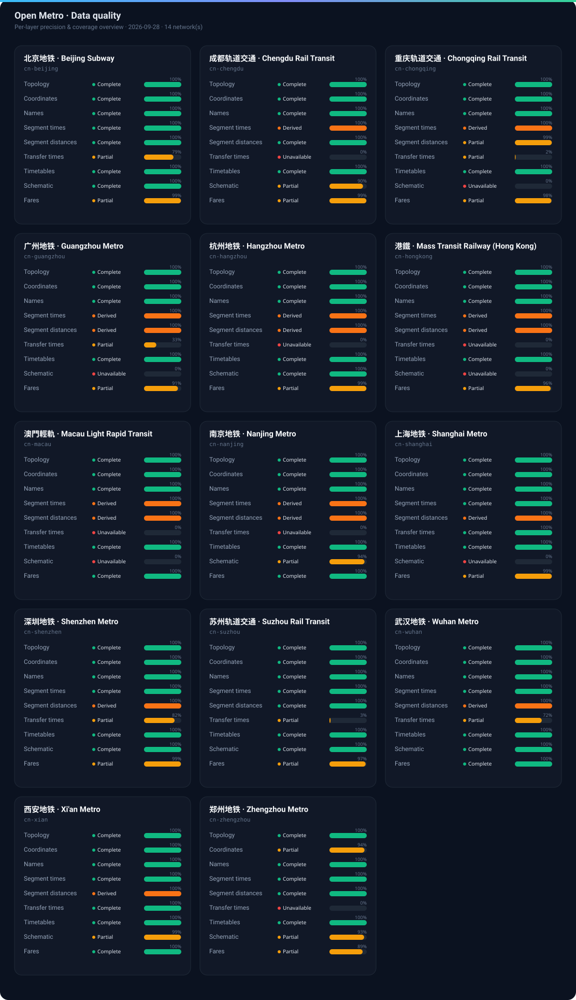

# Data quality

Generated from each network’s canonical records and fares matrix after data sync. Do not edit by hand — re-run `bun run data:sync` (or `scripts/write-quality-report.ts`).

_Updated 2026-09-28T10:12:14.272Z_

## 北京地铁 / Beijing Subway (`cn-beijing`)

| Layer | Status | Precision | Coverage | Counts |
| --- | --- | --- | --- | --- |
| Topology | ✅ Complete | official | 100% | official=1 |
| Coordinates | ✅ Complete | official | 100% | official=411, derived=15 |
| Names | ✅ Complete | official | 100% | official=426 |
| Segment times | ✅ Complete | official | 100% | official=487, derived=27, default=1 |
| Segment distances | ✅ Complete | official | 100% | official=515 |
| Transfer times | 🟡 Partial | official | 79% | official=116, derived=85, default=55 |
| Timetables | ✅ Complete | official | 100% | official=1004 |
| Schematic | ✅ Complete | official | 100% | official=543 |
| Fares | 🟡 Partial | official | 99% | official=179352, default=1698 |

## 成都轨道交通 / Chengdu Rail Transit (`cn-chengdu`)

| Layer | Status | Precision | Coverage | Counts |
| --- | --- | --- | --- | --- |
| Topology | ✅ Complete | official | 100% | official=1 |
| Coordinates | ✅ Complete | official | 100% | official=360, derived=34, default=1 |
| Names | ✅ Complete | official | 100% | official=395 |
| Segment times | 🟠 Derived | derived | 100% | derived=470 |
| Segment distances | ✅ Complete | official | 100% | official=470 |
| Transfer times | ❌ Unavailable | default | 0% | default=200 |
| Timetables | ✅ Complete | official | 100% | official=1030 |
| Schematic | 🟡 Partial | official | 90% | official=440, default=47 |
| Fares | 🟡 Partial | official | 99% | official=154842, default=788 |

## 重庆轨道交通 / Chongqing Rail Transit (`cn-chongqing`)

| Layer | Status | Precision | Coverage | Counts |
| --- | --- | --- | --- | --- |
| Topology | ✅ Complete | official | 100% | official=1 |
| Coordinates | ✅ Complete | official | 100% | official=270, default=1 |
| Names | ✅ Complete | official | 100% | official=271 |
| Segment times | 🟠 Derived | derived | 100% | derived=311, default=1 |
| Segment distances | 🟡 Partial | derived | 99% | derived=310, default=2 |
| Transfer times | 🟡 Partial | derived | 2% | derived=2, default=120 |
| Timetables | ✅ Complete | official | 100% | official=626 |
| Schematic | ❌ Unavailable | default | 0% | default=325 |
| Fares | 🟡 Partial | official | 98% | official=71544, default=1626 |

## 广州地铁 / Guangzhou Metro (`cn-guangzhou`)

| Layer | Status | Precision | Coverage | Counts |
| --- | --- | --- | --- | --- |
| Topology | ✅ Complete | official | 100% | official=1 |
| Coordinates | ✅ Complete | official | 100% | official=498, derived=5 |
| Names | ✅ Complete | official | 100% | official=503 |
| Segment times | 🟠 Derived | derived | 100% | derived=567 |
| Segment distances | 🟠 Derived | derived | 100% | derived=567 |
| Transfer times | 🟡 Partial | derived | 33% | derived=106, default=218 |
| Timetables | ✅ Complete | official | 100% | official=1277 |
| Schematic | ❌ Unavailable | default | 0% | default=599 |
| Fares | 🟡 Partial | official | 91% | official=228800, default=23706 |

## 杭州地铁 / Hangzhou Metro (`cn-hangzhou`)

| Layer | Status | Precision | Coverage | Counts |
| --- | --- | --- | --- | --- |
| Topology | ✅ Complete | official | 100% | official=1 |
| Coordinates | ✅ Complete | official | 100% | official=260, derived=1 |
| Names | ✅ Complete | official | 100% | official=261 |
| Segment times | 🟠 Derived | derived | 100% | derived=299 |
| Segment distances | 🟠 Derived | derived | 100% | derived=299 |
| Transfer times | ❌ Unavailable | default | 0% | default=104 |
| Timetables | ✅ Complete | official | 100% | official=749 |
| Schematic | ✅ Complete | official | 100% | official=308, default=1 |
| Fares | 🟡 Partial | official | 99% | official=67340, default=520 |

## 港鐵 / Mass Transit Railway (Hong Kong) (`cn-hongkong`)

| Layer | Status | Precision | Coverage | Counts |
| --- | --- | --- | --- | --- |
| Topology | ✅ Complete | official | 100% | official=1 |
| Coordinates | ✅ Complete | official | 100% | official=97 |
| Names | ✅ Complete | official | 100% | official=97 |
| Segment times | 🟠 Derived | derived | 100% | derived=110 |
| Segment distances | 🟠 Derived | derived | 100% | derived=110 |
| Transfer times | ❌ Unavailable | default | 0% | default=52 |
| Timetables | ✅ Complete | official | 100% | official=319 |
| Schematic | ❌ Unavailable | default | 0% | default=120 |
| Fares | 🟡 Partial | official | 96% | official=8944, default=368 |

## 澳門輕軌 / Macau Light Rapid Transit (`cn-macau`)

| Layer | Status | Precision | Coverage | Counts |
| --- | --- | --- | --- | --- |
| Topology | ✅ Complete | official | 100% | official=1 |
| Coordinates | ✅ Complete | official | 100% | official=15 |
| Names | ✅ Complete | official | 100% | official=15 |
| Segment times | 🟠 Derived | derived | 100% | derived=14 |
| Segment distances | 🟠 Derived | derived | 100% | derived=14 |
| Transfer times | ❌ Unavailable | default | 0% | default=4 |
| Timetables | ✅ Complete | official | 100% | official=28 |
| Schematic | ❌ Unavailable | default | 0% | default=17 |
| Fares | ✅ Complete | official | 100% | official=210 |

## 南京地铁 / Nanjing Metro (`cn-nanjing`)

| Layer | Status | Precision | Coverage | Counts |
| --- | --- | --- | --- | --- |
| Topology | ✅ Complete | official | 100% | official=1 |
| Coordinates | ✅ Complete | official | 100% | official=240, derived=9 |
| Names | ✅ Complete | official | 100% | official=249 |
| Segment times | 🟠 Derived | derived | 100% | derived=269 |
| Segment distances | 🟠 Derived | derived | 100% | derived=269 |
| Transfer times | ❌ Unavailable | default | 0% | default=74 |
| Timetables | ✅ Complete | official | 100% | official=482 |
| Schematic | 🟡 Partial | official | 94% | official=267, default=16 |
| Fares | ✅ Complete | official | 100% | official=61752 |

## 上海地铁 / Shanghai Metro (`cn-shanghai`)

| Layer | Status | Precision | Coverage | Counts |
| --- | --- | --- | --- | --- |
| Topology | ✅ Complete | official | 100% | official=1 |
| Coordinates | ✅ Complete | official | 100% | official=417 |
| Names | ✅ Complete | official | 100% | official=417 |
| Segment times | ✅ Complete | official | 100% | official=510 |
| Segment distances | 🟠 Derived | derived | 100% | derived=510 |
| Transfer times | ✅ Complete | official | 100% | official=276 |
| Timetables | ✅ Complete | official | 100% | official=1238 |
| Schematic | ❌ Unavailable | default | 0% | default=530 |
| Fares | 🟡 Partial | official | 99% | official=171212, default=2260 |

## 深圳地铁 / Shenzhen Metro (`cn-shenzhen`)

| Layer | Status | Precision | Coverage | Counts |
| --- | --- | --- | --- | --- |
| Topology | ✅ Complete | official | 100% | official=1 |
| Coordinates | ✅ Complete | official | 100% | official=351 |
| Names | ✅ Complete | official | 100% | official=351 |
| Segment times | ✅ Complete | official | 100% | official=416 |
| Segment distances | 🟠 Derived | derived | 100% | derived=416 |
| Transfer times | 🟡 Partial | official | 82% | official=160, default=34 |
| Timetables | ✅ Complete | official | 100% | official=835 |
| Schematic | ✅ Complete | official | 100% | official=433 |
| Fares | 🟡 Partial | official | 99% | official=122150, default=700 |

## 苏州轨道交通 / Suzhou Rail Transit (`cn-suzhou`)

| Layer | Status | Precision | Coverage | Counts |
| --- | --- | --- | --- | --- |
| Topology | ✅ Complete | official | 100% | official=1 |
| Coordinates | ✅ Complete | official | 100% | official=235, derived=4 |
| Names | ✅ Complete | official | 100% | official=239 |
| Segment times | ✅ Complete | official | 100% | official=266, derived=4 |
| Segment distances | ✅ Complete | official | 100% | official=266, derived=4 |
| Transfer times | 🟡 Partial | derived | 3% | derived=2, default=78 |
| Timetables | ✅ Complete | official | 100% | official=534 |
| Schematic | ✅ Complete | official | 100% | official=279 |
| Fares | 🟡 Partial | official | 97% | official=54990, default=1892 |

## 武汉地铁 / Wuhan Metro (`cn-wuhan`)

| Layer | Status | Precision | Coverage | Counts |
| --- | --- | --- | --- | --- |
| Topology | ✅ Complete | official | 100% | official=1 |
| Coordinates | ✅ Complete | official | 100% | official=289 |
| Names | ✅ Complete | official | 100% | official=289 |
| Segment times | ✅ Complete | official | 100% | official=321, derived=1 |
| Segment distances | 🟠 Derived | derived | 100% | official=1, derived=321 |
| Transfer times | 🟡 Partial | official | 72% | official=72, default=28 |
| Timetables | ✅ Complete | official | 100% | official=682 |
| Schematic | ✅ Complete | official | 100% | official=335 |
| Fares | ✅ Complete | official | 100% | official=83232 |

## 西安地铁 / Xi'an Metro (`cn-xian`)

| Layer | Status | Precision | Coverage | Counts |
| --- | --- | --- | --- | --- |
| Topology | ✅ Complete | official | 100% | official=1 |
| Coordinates | ✅ Complete | official | 100% | official=247, derived=1 |
| Names | ✅ Complete | official | 100% | official=248 |
| Segment times | ✅ Complete | official | 100% | official=274, derived=1 |
| Segment distances | 🟠 Derived | derived | 100% | derived=275 |
| Transfer times | ✅ Complete | official | 100% | official=82 |
| Timetables | ✅ Complete | official | 100% | official=553 |
| Schematic | 🟡 Partial | official | 99% | official=283, default=4 |
| Fares | ✅ Complete | official | 100% | official=61256 |

## 郑州地铁 / Zhengzhou Metro (`cn-zhengzhou`)

| Layer | Status | Precision | Coverage | Counts |
| --- | --- | --- | --- | --- |
| Topology | ✅ Complete | official | 100% | official=1 |
| Coordinates | 🟡 Partial | official | 94% | official=221, derived=1, default=13 |
| Names | ✅ Complete | official | 100% | official=235 |
| Segment times | ✅ Complete | official | 100% | official=274, default=1 |
| Segment distances | ✅ Complete | official | 100% | official=274, default=1 |
| Transfer times | ❌ Unavailable | default | 0% | default=108 |
| Timetables | ✅ Complete | official | 100% | official=546 |
| Schematic | 🟡 Partial | official | 93% | official=267, default=20 |
| Fares | 🟡 Partial | official | 89% | official=49062, default=5928 |

### Legend

| Status | Meaning |
| --- | --- |
| ✅ complete | Full coverage, official values |
| 🟡 partial | Some entities still use network defaults |
| 🟠 derived | Full coverage but only derived values |
| ❌ unavailable | No source values |

